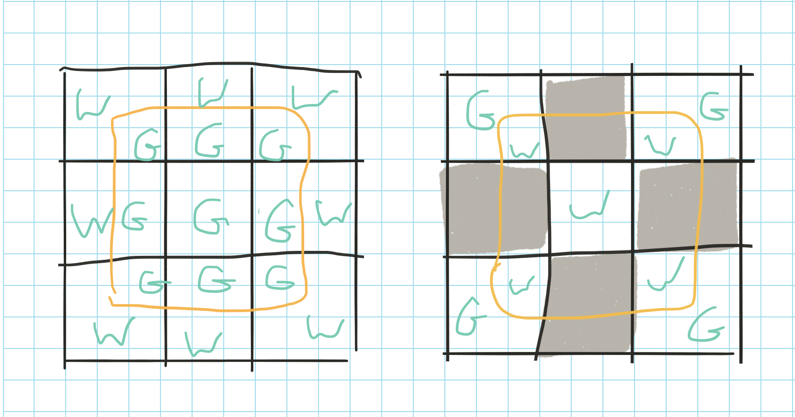
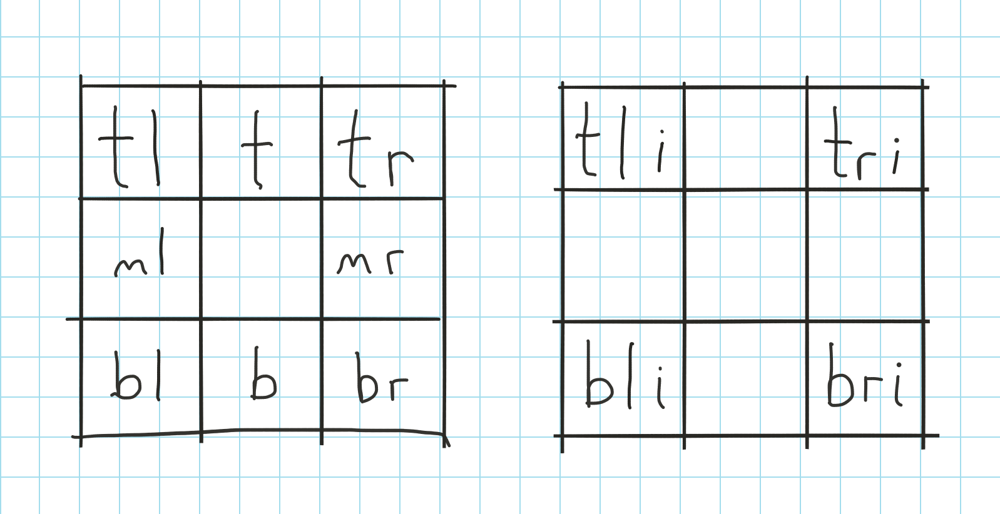

# Editor Map Format

The Link Against the World Studio editor map is represented on disk by an OS X bundle. The bundle contains a control file and one or more of the following:

- [Tile Sets](#tile-sets)
- [Brush Sets](#brush-sets)
- [Terrain Sets](#terrain-sets)
- [Tile Layers](#tile-layers)
- Object Layers (TBD)
- Static Objects (TBD)
- Entity Spawners (TBD)

The expectation is that these files may be stored in a revision control system, and so text formats are preferred. Binary blobs, where necessary, exist within their own file.

## Tile Sets

A tile set is a bundle containing a single TIFF image file and a control file. The control file (Info.plist) is an XML plist with the following required properties:

 Key | Value Description
-----|-------------------
version | Currently always 1.0
image | Name of the TIFF file
tileCount | Number of tiles in the tile set
tileWidth | Width of the tiles, in points
tileHeight | Height of the tiles, in points
name | A string uniquely identifying this tile set within a map bundle

The TIFF contains images of each tile laid out in a grid. There must be no space between each tile. Multi-TIFF may be used to represent tiles as different point sizes (Retina support, for example). Any TIFF feature supported by OS X's built-in TIFF support are allowed.

Just as there is no space allowed between tiles in the tile set image, the image itself must not have any extra space around the grid of tiles. Therefore, the image's dimensions must be evenly divisible by the tile width / height. 

Tiles are referenced in the tile set by index. The index is computed row-first from the top left of the the tiles image.

Indexes into a tile set are expected to be permanent. If a tile is deleted, its image data is removed, but the slot it took in the image file will remain vacant.

The control file my optionally contain the following key:

 Key | Value Description
-----|-------------------
unused | Array of indices for deleted tiles. New tiles may safely be placed in an unused index.

## Brush Sets

A brush is an organized collection of tiles from a single tile set which, when drawn together, create a larger image. For example, a house in a town may be made up of an 8x8 grid of tiles. A brush could be made of this set of tiles, facilitating placement of the house on a map.

A brush set is a collection of brushes dependent on a single tile set. Note that while a brush set may depend on only one tile set, a tile set can be depended upon by any number of brush sets.

A brush set is represented by an XML plist file with the following keys:

 Key | Value Description
-----|-------------------
version | Currently always 1.0
name | A string uniquely identifying this brush set within a map bundle
brushes | An array of brush definitions

Brush are stored in the brush set as a dictionary with the following keys (all keys required):

 Key | Value Description
-----|-------------------
name | A string uniquely identifying this brush within the brush set
width | The width of the brush in tiles
height | The height of the brush in tiles
brushData | An array of strings, each string representing a row in the brush. Rows are ordered from top to bottom.

Each row is a comma separated list of indexes into the tile set for each column in the brush. Columns are listed from left-to-right. 

## Terrain Sets

At its simplest, a terrain is an ordered grid of tiles, like a brush, which can be repeated over a large area of a map (useful, for example, for basic ground). More complicated terrain can be define a set of border tiles to be used when the terrain comes into contact with specific other tiles. For example, a grass terrain may define a set of border tiles containing a beach when bordered by water:

In this example, the terrain is a single tile of grass (G). The image on the left defines the border between this terrain and a water (W) tile for convex shapes. The right image is the same for concave shapes. Both convex and concave borders are required, though the straight edges should not be repeated. 

A terrain set is a collection of terrains dependent on a single tile set. Terrain sets of represented by an XML plist file with the following required keys:

 Key | Value Description
-----|-------------------
version | Currently always 1.0
name | A string uniquely identifying the terrain set within the map
terrains | An array of terrain definitions

Terrains are stored in the plist as a dictionary:

 Key | Value Description
-----|-------------------
name | A string uniquely identifying the terrain within the set
width | The width, in tiles, of the terrain pattern
height | The height, in tiles, of the terrain pattern
borders | Dictionary of terrain border definitions

The keys for the border definitions are comma separated lists of the tile indexes for all tiles which should use this border when next to this terrain. The value is a dictionary defining the border. Each key in the dictionary represents one of the border sections (defined below) and the value is the index of the tile used for that section.

## Tile Layers

A tile layer is a rectangular grid of tiles and terrains which represents a layer of the map. All tiles in the tile layer must come from the same tile set. Likewise, all terrains must use that same tile set.

A tile layer is represented by an XML plist with the following keys:

 Key | Value Description
-----|-------------------
version | Currently always 1.0
name | A string uniquely identifying the layer within the map
tileset | The name of the tile set used by the layer
terrains | An array of terrain names used by the layer
layerData | An array of strings representing the layer data. Each entry in the array represents a row in the layer, from top to bottom. The string is a comma separated list of values. Each value represents a cell in a column of the layer, from left to right. Definitions of these values are found in the table below.
zIndex | The z-index for this tile layer. Higher numbers are "closer" to the user.

A cell definition may have one of three formats:

 Format | Meaning
--------|---------
- | An empty cell. This is equivalent to a completely transparent tile.
tileIndex | The index of the tile occupying this cell.
tsi:ti | tsi is the index into the array of terrain sets associated with this layer for the cell. ti is the index of the terrain within that terrain set which occupies the cell.

